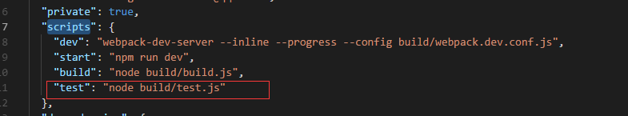

### vue多页应用及webpack添加测试环境

## 多页应用
> 参考 https://segmentfault.com/a/1190000011265006

#首先修改package.json
>package.json>devDependencies> "glob": "^7.0.3"

# 多页待更新 

## 多页条件下添加除生产（build）与开发（dev）环境外的测试环境
>注：多页与单页环境配置大致相同、区别在于多页与单页的入口、出口配置不一样

# package.json 修改如下


# webpack修改
1. 在build下新增test.js、webpack.test.conf.js、修改webpack.base.conf.js 代码如下
* 新增test.js
  ```
   'use strict'
    require('./check-versions')()

    process.env.NODE_ENV = 'test'

    const ora = require('ora')
    const rm = require('rimraf')
    const path = require('path')
    const chalk = require('chalk')
    const webpack = require('webpack')
    const config = require('../config')
    const webpackConfig = require('./webpack.test.conf')
    /**
    * 引入webpack.test.conf.js
    */
    const spinner = ora('building for test...') 
    spinner.start()

    rm(path.join(config.build.assetsRoot, config.build.assetsSubDirectory), err => {
        if (err) throw err
        webpack(webpackConfig, (err, stats) => {
            spinner.stop()
            if (err) throw err
            process.stdout.write(stats.toString({
                colors: true,
                modules: false,
                children: false, 
                during build.
                chunks: false,
                chunkModules: false
            }) + '\n\n')

            if (stats.hasErrors()) {
                console.log(chalk.red('  Build failed with errors.\n'))
                process.exit(1)
            }

            console.log(chalk.cyan('  Build complete.\n'))
            console.log(chalk.yellow(
                '  Tip: built files are meant to be served over an HTTP server.\n' +
                '  Opening index.html over file:// won\'t work.\n'
            ))
        })
    })
  ```

* 新增webpack.test.conf.js
  ```
    'use strict'
    const path = require('path')
    const utils = require('./utils')
    const webpack = require('webpack')
    const config = require('../config')
    const merge = require('webpack-merge')
    const baseWebpackConfig = require('./webpack.base.conf')
    const CopyWebpackPlugin = require('copy-webpack-plugin')
    const ExtractTextPlugin = require('extract-text-webpack-plugin')
    const OptimizeCSSPlugin = require('optimize-css-assets-webpack-plugin')
    const UglifyJsPlugin = require('uglifyjs-webpack-plugin')
     /**
    * 引入config/test.env
    */
    const env = require('../config/test.env')

    const webpackConfig = merge(baseWebpackConfig, {
        module: {
            rules: utils.styleLoaders({
                sourceMap: config.build.productionSourceMap,
                extract: true,
                usePostCSS: true
            })
        },
        devtool: config.build.productionSourceMap ? config.build.devtool : false,
        output: {
            path: config.build.assetsRoot,
            filename: utils.assetsPath('js/[name].[chunkhash].js'),
            chunkFilename: utils.assetsPath('js/[id].[chunkhash].js')
        },
        plugins: [
            new webpack.DefinePlugin({
                'process.env': env
            }),
            new UglifyJsPlugin({
                uglifyOptions: {

                    compress: {
                        // 打包时禁用console、debugger、warnings
                        warnings: false,
                        drop_console: true,
                        drop_debugger: true,
                    }
                },
                sourceMap: config.build.productionSourceMap,
                parallel: true
            }),
            new ExtractTextPlugin({
                filename: utils.assetsPath('css/[name].[contenthash].css'),
                allChunks: true,
            }),
            new OptimizeCSSPlugin({
                cssProcessorOptions: config.build.productionSourceMap
                    ? { safe: true, map: { inline: false } }
                    : { safe: true }
            }),
            new webpack.HashedModuleIdsPlugin(),
            new webpack.optimize.ModuleConcatenationPlugin(),
            new webpack.optimize.CommonsChunkPlugin({
                name: 'vendor',
                minChunks(module) {
                    // any required modules inside node_modules are extracted to vendor
                    return (
                        module.resource &&
                        /\.js$/.test(module.resource) &&
                        module.resource.indexOf(
                            path.join(__dirname, '../node_modules')
                        ) === 0
                    )
                }
            }),
            new webpack.optimize.CommonsChunkPlugin({
                name: 'manifest',
                minChunks: Infinity
            }),
            new webpack.optimize.CommonsChunkPlugin({
                name: 'app',
                async: 'vendor-async',
                children: true,
                minChunks: 3
            }),
            new CopyWebpackPlugin([
                {
                    from: path.resolve(__dirname, '../static'),
                    to: config.build.assetsSubDirectory,
                    ignore: ['.*']
                }
            ])
        ].concat(utils.htmlPlugin())
    })

    if (config.build.productionGzip) {
        const CompressionWebpackPlugin = require('compression-webpack-plugin')

        webpackConfig.plugins.push(
            new CompressionWebpackPlugin({
                asset: '[path].gz[query]',
                algorithm: 'gzip',
                test: new RegExp(
                    '\\.(' +
                    config.build.productionGzipExtensions.join('|') +
                    ')$'
                ),
                threshold: 10240,
                minRatio: 0.8
            })
        )
    }

    if (config.build.bundleAnalyzerReport) {
        const BundleAnalyzerPlugin = require('webpack-bundle-analyzer').BundleAnalyzerPlugin
        webpackConfig.plugins.push(new BundleAnalyzerPlugin())
    }

    module.exports = webpackConfig
  ```
* 修改webpack.base.conf.js
  ```
    output: {
        path: config.build.assetsRoot,
        filename: '[name].js',
        publicPath: (process.env.NODE_ENV === 'production' || process.env.NODE_ENV === 'test')
        ? config.build.assetsPublicPath
        : config.dev.assetsPublicPath
    }
  ```
2. 在config中新增 test.env.js、修改index.js，代码如下
* 新增test.env.js
  ```
    'use strict'
    module.exports = {
        NODE_ENV: '"test"',
    }
  ```
* 修改index.js
  ```
    test: {
        index: path.resolve(__dirname, '../test/index.html'),
        assetsRoot: path.resolve(__dirname, '../test'),
        assetsSubDirectory: 'static',
        /**
        * 解决打包后页面出现空白的问题(npm run test)
        */
        assetsPublicPath: './',
        productionSourceMap: true,
        devtool: '#source-map',
        productionGzip: false,
        productionGzipExtensions: ['js', 'css'],
        bundleAnalyzerReport: process.env.npm_config_report
    }
  ```