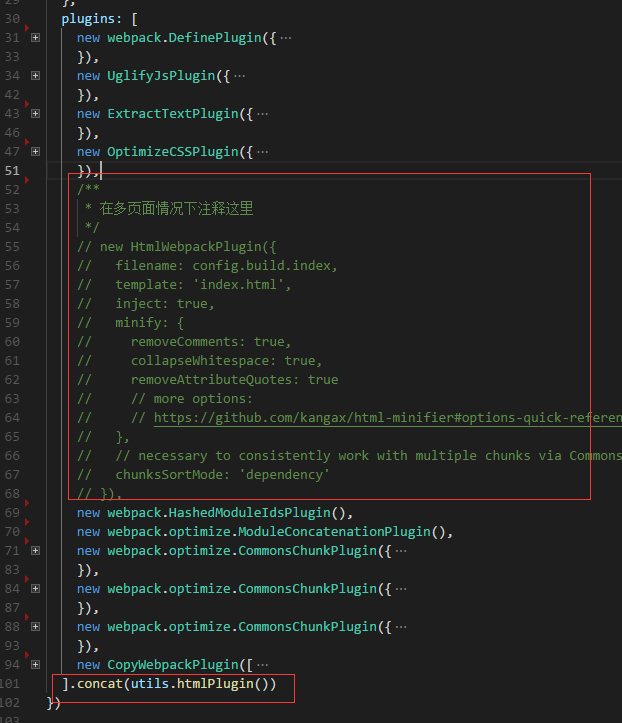
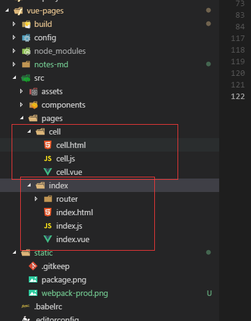

<!-- TOC -->

- [vue多页配置（默认只有开发环境与生产环境，测试与其他等多环境配置参考生产环境的配置）](#vue多页配置默认只有开发环境与生产环境测试与其他等多环境配置参考生产环境的配置)
    - [参考 https://segmentfault.com/a/1190000011265006](#参考-httpssegmentfaultcoma1190000011265006)
    - [添加依赖](#添加依赖)
    - [在build/utils.js中添加如下代码](#在buildutilsjs中添加如下代码)
    - [修改build/webpack.base.conf.js](#修改buildwebpackbaseconfjs)
    - [修改webpack.dev.conf.js（开发环境）](#修改webpackdevconfjs开发环境)
    - [修改webpack.prod.conf.js（生产环境）](#修改webpackprodconfjs生产环境)
    - [修改项目目录结构](#修改项目目录结构)
    - [总结](#总结)

<!-- /TOC -->
## vue多页配置（默认只有开发环境与生产环境，测试与其他等多环境配置参考生产环境的配置）
### 参考 https://segmentfault.com/a/1190000011265006

### 添加依赖
>第一种方法：在package.json文件devDependencies的值里面添加 "glob": "^7.0.3" ,然后执行npm install
```
以上省略
"webpack-bundle-analyzer": "^2.9.0",
"webpack-dev-server": "^2.9.1",
"webpack-merge": "^4.1.0",
"glob": "^7.0.3" // 第三方依赖
```
>第二种方法：npm install glob --save

### 在build/utils.js中添加如下代码

```
// glob是webpack安装时依赖的一个第三方模块，还模块允许你使用 *等符号, 例如lib/*.js就是获取lib文件夹下的所有js后缀名的文件
const glob = require('glob')
// 页面模板
const HtmlWebpackPlugin = require('html-webpack-plugin')
// 取得相应的页面路径，因为之前的配置，所以是src文件夹下的pages文件夹
const PAGE_PATH = path.resolve(__dirname, '../src/pages')
// 用于做相应的merge处理
const merge = require('webpack-merge')


//多入口配置
// 通过glob模块读取pages文件夹下的所有对应文件夹下的js后缀文件，如果该文件存在那么就作为入口处理
exports.entries = function () {
  const entryFiles = glob.sync(PAGE_PATH + '/*/*.js')
  const map = {}
  entryFiles.forEach((filePath) => {
    const filename = filePath.substring(filePath.lastIndexOf('\/') + 1, filePath.lastIndexOf('.'))
    map[filename] = filePath
  })
  return map
}

//多页面输出配置
// 与上面的多页面入口配置相同，读取pages文件夹下的对应的html后缀文件，然后放入数组中
exports.htmlPlugin = function () {
  let entryHtml = glob.sync(PAGE_PATH + '/*/*.html')
  let arr = []
  entryHtml.forEach((filePath) => {
    let filename = filePath.substring(filePath.lastIndexOf('\/') + 1, filePath.lastIndexOf('.'))
    let conf = {
      // 模板来源
      template: filePath,
      // 文件名称
      filename: filename + '.html',
      // 页面模板需要加对应的js脚本，如果不加这行则每个页面都会引入所有的js脚本
      chunks: ['manifest', 'vendor', filename],
      inject: true
    }
    if (process.env.NODE_ENV === 'production') {
      conf = merge(conf, {
        minify: {
          removeComments: true,
          collapseWhitespace: true,
          removeAttributeQuotes: true
        },
        chunksSortMode: 'dependency'
      })
    }
    arr.push(new HtmlWebpackPlugin(conf))
  })
  return arr
}

```

### 修改build/webpack.base.conf.js
>在webpack.base.conf.js中引入utils文件，修改入口文件
```
const utils = require('./utils')

entry: utils.entries(),
  // entry: {
  //   app: './src/main.js'
  // },
```

### 修改webpack.dev.conf.js（开发环境）
>在plugins 中注释掉new HtmlWebpackPlugin 相关代码、引入utils合并数组concat(utils.htmlPlugin())
```
const utils = require('./utils')

plugins: [
    new webpack.DefinePlugin({
        'process.env': require('../config/dev.env')
    }),
    new webpack.HotModuleReplacementPlugin(),
    new webpack.NamedModulesPlugin(), // HMR shows correct file names in console on update.
    new webpack.NoEmitOnErrorsPlugin(),
    // https://github.com/ampedandwired/html-webpack-plugin
    /**
        * 在多页面情况下注释这里
        */
    // new HtmlWebpackPlugin({
    //   filename: 'index.html',
    //   template: 'index.html',
    //   inject: true
    // }),
    // copy custom static assets

    new CopyWebpackPlugin([
        {
        from: path.resolve(__dirname, '../static'),
        to: config.dev.assetsSubDirectory,
        ignore: ['.*']
        }
    ])
<!-- 多页修改 -->
].concat(utils.htmlPlugin())
```
### 修改webpack.prod.conf.js（生产环境）

>在plugins中注释new HtmlWebpackPlugin相关配置、引入utils合并数组concat(utils.htmlPlugin())、参考开发环境配置



### 修改项目目录结构


>index下面的文件代表着单页的main.js index.html App.vue

### 总结
>在多页面项目中，每一个多页文件就是一个vue实例、这些vue实例可以共用方法及组件、路由除外
